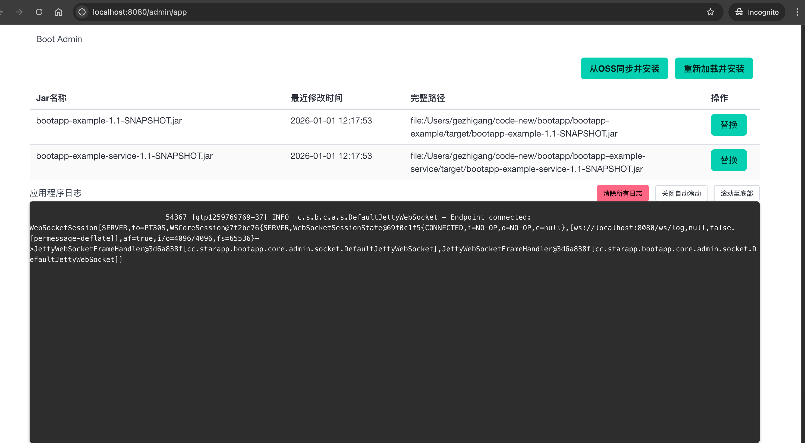

# Bootapp

[](https://opensource.org/licenses/MIT)
[](https://openjdk.org/)
[](https://www.eclipse.org/jetty/)

[中文文档](README_CN.md)

**Bootapp** is a lightweight hot-reload framework for Java web applications. It enables rapid iteration by allowing you to update business logic JARs (typically < 1MB) without restarting the entire application, eliminating the need to redeploy bloated full application packages (often > 100MB).

## Screenshot



The admin console provides:
- **JAR Management** - View all loaded business JARs with modification timestamps and file paths
- **Hot Reload** - Click "替换" (Replace) to upload a new JAR, the system will automatically reload it
- **Real-time Logs** - View application logs instantly via WebSocket connection

---

## Features

- **Hot Reload** - Update business JARs without server restart
- **Lightweight Deployment** - Deploy only business code (< 1MB) instead of full packages (> 100MB)
- **File Monitoring** - Automatic reload when JAR files change
- **Admin Console** - Web UI for JAR management and real-time logs
- **ClassLoader Isolation** - Business code isolated from framework code
- **Spring Boot Integration** - Seamless integration with Spring Boot 3.x

---

## Architecture

```
┌─────────────────────────────────────────────────────────┐
│                    Bootapp Server                        │
├─────────────────────────────────────────────────────────┤
│  ┌─────────────┐  ┌─────────────┐  ┌─────────────────┐  │
│  │ Admin       │  │ File        │  │ WebSocket       │  │
│  │ Console     │  │ Monitor     │  │ Log Streaming   │  │
│  └─────────────┘  └─────────────┘  └─────────────────┘  │
├─────────────────────────────────────────────────────────┤
│                   BootContext (Reload Manager)           │
├─────────────────────────────────────────────────────────┤
│  ┌─────────────────────────────────────────────────┐    │
│  │            AppClassLoader (Isolated)             │    │
│  │  ┌─────────┐  ┌─────────┐  ┌─────────┐         │    │
│  │  │ JAR 1   │  │ JAR 2   │  │ JAR N   │  ...    │    │
│  │  └─────────┘  └─────────┘  └─────────┘         │    │
│  └─────────────────────────────────────────────────┘    │
├─────────────────────────────────────────────────────────┤
│                 Jetty Server (Modified)                  │
└─────────────────────────────────────────────────────────┘
```

---

## Quick Start

### Requirements

- Java 17+
- Maven 3.6+

### Build

```bash
git clone https://github.com/gezhigang000/bootapp.git
cd bootapp
mvn clean install
```

### Run

```java
public static void main(String[] args) {
    // Configure JAR directories
    EmbeddedAppConfig embeddedAppConfig = new EmbeddedAppConfig();
    embeddedAppConfig.setLibAbsoluteDirs(new String[]{
        "/path/to/your/business-jars"
    });

    // Create server config
    ServerConfig serverConfig = new ServerConfig(
        AppRunMode.embedded,
        embeddedAppConfig
    );
    serverConfig.setSpringConfigLocations(new String[]{
        "cc.starapp.bootapp.core.admin"
    });
    serverConfig.setSpringProfileActive("daily");

    // Start server
    final BootServer server = new BootServer(serverConfig);
    server.start();
}
```

---

## Creating a Business JAR

### 1. Implement HowInstall Interface

```java
public class MyAppInstall implements HowInstall {

    @Override
    public String appName() {
        return "my-business-app";
    }

    @Override
    public String appWebContext() {
        return "/api";
    }

    @Override
    public String[] basePackages() {
        return new String[]{"com.example.myapp"};
    }

    @Override
    public Class<?> appClass() {
        return MyAppConfig.class;
    }
}
```

### 2. Register via ServiceLoader

Create file: `META-INF/services/cc.starapp.bootapp.core.HowInstall`

```
com.example.myapp.MyAppInstall
```

### 3. Package and Deploy

```bash
mvn clean package
cp target/my-business-app.jar /path/to/monitored/directory/
```

The server will automatically detect and reload the new JAR.

---

## Configuration

### ServerConfig Options

| Property | Default | Description |
|----------|---------|-------------|
| `port` | 8080 | Server port |
| `host` | 0.0.0.0 | Bind address |
| `contextPath` | / | Context path |
| `adminMapping` | /admin/* | Admin console URL |
| `minThreads` | 100 | Min thread pool size |
| `maxThreads` | 500 | Max thread pool size |
| `appRunMode` | embedded | Run mode: embedded/standalone |

### EmbeddedAppConfig Options

| Property | Description |
|----------|-------------|
| `libAbsoluteDirs` | Directories to scan for JARs |
| `includeByNameRegex` | Regex to include JARs |
| `excludeByNameRegex` | Regex to exclude JARs |

---

## Admin Console

Access the admin console at `http://localhost:8080/admin/app`

### Features

- **View Loaded JARs** - See all currently loaded business JARs
- **Upload JAR** - Upload new JAR files for hot-reload
- **Manual Reload** - Trigger reload manually
- **Real-time Logs** - View application logs via WebSocket

### REST API

| Endpoint | Method | Description |
|----------|--------|-------------|
| `/admin/app` | GET | List loaded JARs |
| `/admin/jar/upload` | POST | Upload JAR file |
| `/admin/reInstall` | GET | Trigger reload |
| `/admin/hi` | GET | Health check |

---

## Project Structure

```
bootapp/
├── bootapp-core/        # Core framework
│   ├── boot/            # Server & context management
│   ├── app/             # ClassLoader & JAR management
│   └── admin/           # Admin console
├── bootapp-starter/     # Application entry point
├── bootapp-support/     # Feign & utilities
├── bootapp-example/     # Example application
└── bootapp-example-service/  # Example service
```

---

## How It Works

1. **Initialization** - BootServer starts Jetty with custom configuration
2. **JAR Loading** - AppJarHolder scans configured directories for JARs
3. **ClassLoader Creation** - AppClassLoader loads business classes in isolation
4. **Spring Context** - EmbeddedApplicationContext creates Spring context for business code
5. **File Monitoring** - FileListener watches for JAR changes
6. **Hot Reload** - On change, BootContext destroys old context and creates new one

---

## Dependencies

- Jetty 11.0.11
- Spring Boot 3.0.5
- FastJSON
- Apache Commons IO
- Logback 1.4.5
- OpenFeign 12.1

---

## License

This project is licensed under the MIT License - see the [LICENSE](LICENSE) file for details.

---

## Contributing

Contributions are welcome! Please feel free to submit a Pull Request.

1. Fork the repository
2. Create your feature branch (`git checkout -b feature/AmazingFeature`)
3. Commit your changes (`git commit -m 'Add some AmazingFeature'`)
4. Push to the branch (`git push origin feature/AmazingFeature`)
5. Open a Pull Request
